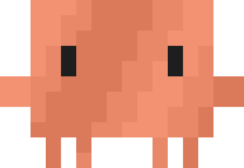

<div align="center">


<h1>ccnotifs</h1>

Native macOS notifications for <a href="https://docs.anthropic.com/en/docs/claude-code" target="_blank">Claude Code</a>.
Know when Claude finishes or needs your input. Click notifications to bring into focus the tmux pane that spawned the notification.

<a href="https://www.apple.com/macos/" target="_blank"></a>
<a href="notify.sh"></a>
<a href="LICENSE"></a>

<br>


</div>

## Features

- **One-tap approve** — Approve permission prompts directly from the notification
- **Two notification types** — "Done" when Claude finishes, "Needs Input" when Claude needs approval
- **Command preview** — Shows the tool name and command in the notification body
- **Teleport** — Click a notification to teleport back to the right terminal, tmux session, window, and pane
- **tmux context** — Shows session name, window number, and window name
- **Project name** — Displays the current project directory
- **Suppression** — Skips notifications when you're already viewing the Claude Code session
- **Custom icon** — Use your own app icon instead of the default Script Editor icon
- **Sound** — Plays a sound per notification type

```
Claude Code — Done
myproject w3 > feature-branch · my-app
Claude has finished and is awaiting further instructions
```

## Quick Start

```bash
brew install jq
brew install vjeantet/tap/alerter

curl -fsSL https://raw.githubusercontent.com/polyphilz/ccnotifs/main/install.sh | bash
```

The bootstrap installer resolves the latest GitHub release by default.

- Pin a release: `curl -fsSL https://raw.githubusercontent.com/polyphilz/ccnotifs/main/install.sh | CCNOTIFS_REF=vX.Y.Z bash`
- Install unreleased `main`: `curl -fsSL https://raw.githubusercontent.com/polyphilz/ccnotifs/main/install.sh | CCNOTIFS_REF=main bash`

The install script:
1. Downloads `notify.sh`, `stash_command.sh`, and `clawd-mascot-notif-icon.png` into `~/.claude/hooks/`
2. Prints the hooks config to add to your `settings.json`

## How it works

Claude Code's <a href="https://docs.anthropic.com/en/docs/claude-code/hooks" target="_blank">hooks system</a> runs shell commands on lifecycle events:

| Hook | Event | Purpose |
|------|-------|---------|
| `PreToolUse` | Before every tool call | Stashes the tool name and command to a temp file |
| `Notification` | Claude needs approval (permission prompt) | "Claude Code — Needs Input" |
| `Stop` | Claude finishes responding | "Claude Code — Done" |

The script reads JSON from stdin (provided by Claude Code), extracts the working directory, and queries tmux for session/window context. If you're already looking at the session in a supported terminal (Ghostty, iTerm2, Alacritty, kitty, WezTerm, Terminal), the notification is suppressed.

### Approve from notification

When [alerter](https://github.com/vjeantet/alerter) is installed, "Needs Input" notifications include an **Approve** button and show the command in the notification body:

```
┌──────────────────────────────────────────┐
│ Claude Code — Needs Input                │
│ kb w2 > ccnotifs · ccnotifs              │
│ Claude is waiting for your input         │
│                              [Options v] │
│  ┌─────────────────────────────────────┐ │
│  │ Show                                │ │
│  │ 1: Yes                              │ │
│  │ 2: Yes; and don't ask again for: …  │ │
│  │ 3: No                               │ │
│  │ Dismiss                             │ │
│  └─────────────────────────────────────┘ │
└──────────────────────────────────────────┘
```

- **Click Show** — teleport to the tmux pane to review the command manually
- **Click a numbered option** — sends that choice to the tmux pane
- **Click Dismiss** — does nothing

Without alerter, the script falls back to `osascript` notifications with no teleport or approve action.

### Notification priority

For both notification types:

1. **`alerter`** — custom icon + teleport, and `Approve` for "Needs Input"
2. **`osascript`** — zero dependencies, but no teleport support

### Teleport

When `alerter` is installed, clicking a notification brings you back to where Claude Code is running. It activates your terminal, switches to the correct tmux session, selects the right window, and focuses the exact pane.

Supported terminals: Terminal.app, iTerm2, Ghostty, Alacritty, kitty, WezTerm.

<details>
<summary><strong>Manual setup</strong></summary>

If you prefer not to use `install.sh`:

**1. Download the script:**

```bash
REF="vX.Y.Z" # replace with a real release tag, or use main

mkdir -p ~/.claude/hooks
curl -fsSL "https://raw.githubusercontent.com/polyphilz/ccnotifs/${REF}/notify.sh" -o ~/.claude/hooks/notify.sh
curl -fsSL "https://raw.githubusercontent.com/polyphilz/ccnotifs/${REF}/stash_command.sh" -o ~/.claude/hooks/stash_command.sh
curl -fsSL "https://raw.githubusercontent.com/polyphilz/ccnotifs/${REF}/clawd-mascot-notif-icon.png" -o ~/.claude/hooks/clawd-mascot-notif-icon.png
chmod +x ~/.claude/hooks/notify.sh ~/.claude/hooks/stash_command.sh
```

**2. Add hooks to `~/.claude/settings.json`:**

```json
{
  "hooks": {
    "PreToolUse": [
      {
        "matcher": "",
        "hooks": [
          {
            "type": "command",
            "command": "~/.claude/hooks/stash_command.sh"
          }
        ]
      }
    ],
    "Notification": [
      {
        "matcher": "permission_prompt",
        "hooks": [
          {
            "type": "command",
            "command": "~/.claude/hooks/notify.sh needs_input"
          }
        ]
      }
    ],
    "Stop": [
      {
        "matcher": "",
        "hooks": [
          {
            "type": "command",
            "command": "~/.claude/hooks/notify.sh done"
          }
        ]
      }
    ]
  }
}
```

**3. Activate the hooks.**

Open the `/hooks` menu in Claude Code to review and accept the new hooks, or restart your session.

</details>

<details>
<summary><strong>Troubleshooting</strong></summary>

**Notifications don't appear when screen recording or mirroring:**
macOS suppresses banners during screen sharing as a privacy feature. Fix: System Settings > Notifications > "Allow notifications when mirroring or sharing the display" > Allow Notifications.

**Notifications show in Notification Center but not as banners:**
Check System Settings > Notifications > find the app that `alerter` is posting as on your system and set alert style to "Banners" or "Alerts".

**tmux info not showing:**
Make sure Claude Code is running inside a tmux session. The `$TMUX` and `$TMUX_PANE` environment variables must be set.

</details>

## License

MIT
